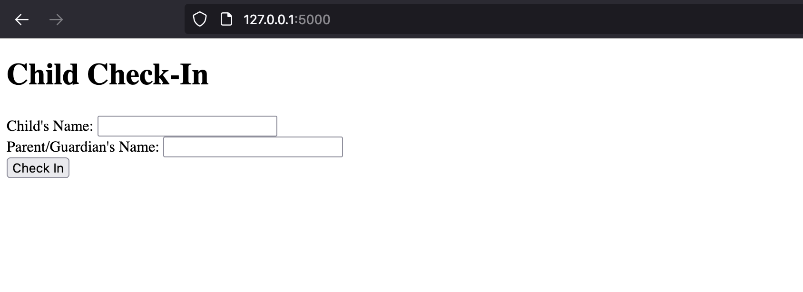
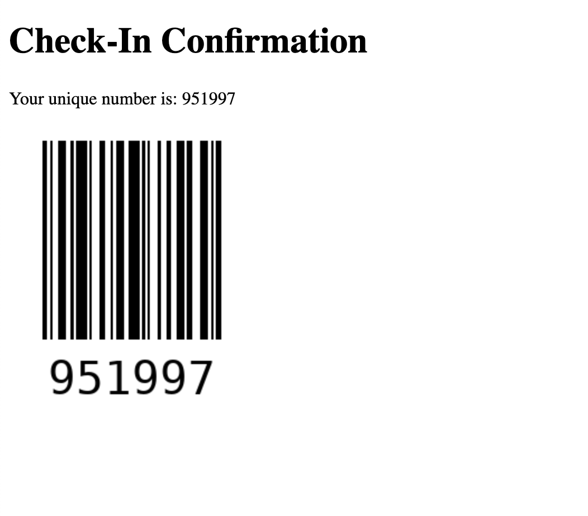
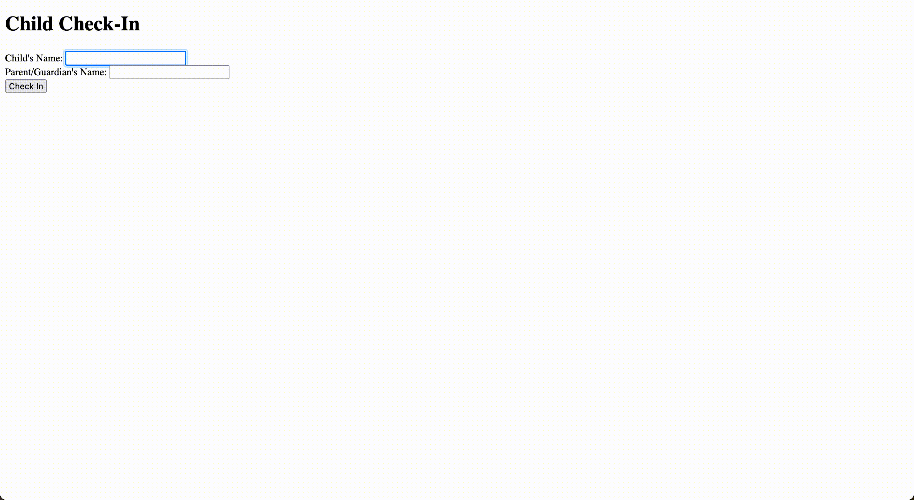

# CheckInAChild
an application for check-in and pickup with security

## Setup 
### Install Flask
```pip3 install flask```
### Install reportlab
```pip3 install flask python-barcode reportlab```

## Run App
```python3 app.py```



### After entering a child's name and parent's name, a barcode is generated with random number. 



## See it in action! 



## End Goal 
To print out one ticket for child, one for the parent. This allows for secure pickup- matching the unqiue pickup number from the parent to the child. 