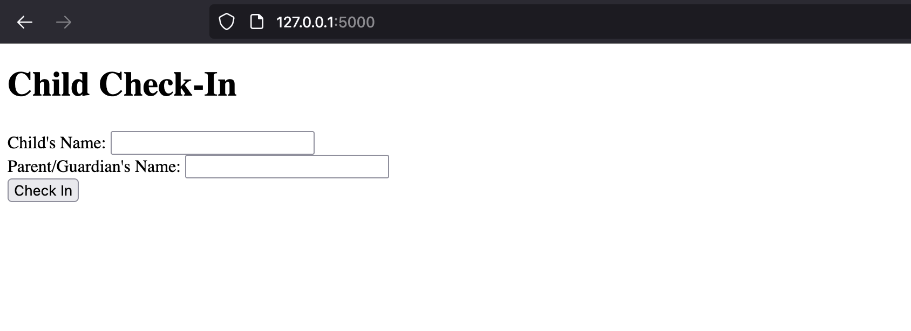

# CheckInAChild
an application for check-in and pickup with security

## Setup 
### Install Flask
```pip3 install flask```
### Install reportlab
```pip3 install flask python-barcode reportlab```

## Run App
```python3 app.py```
